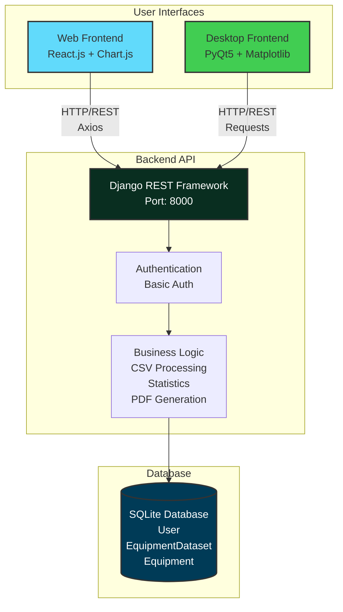
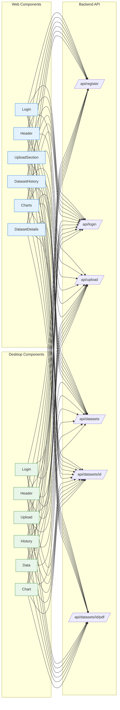
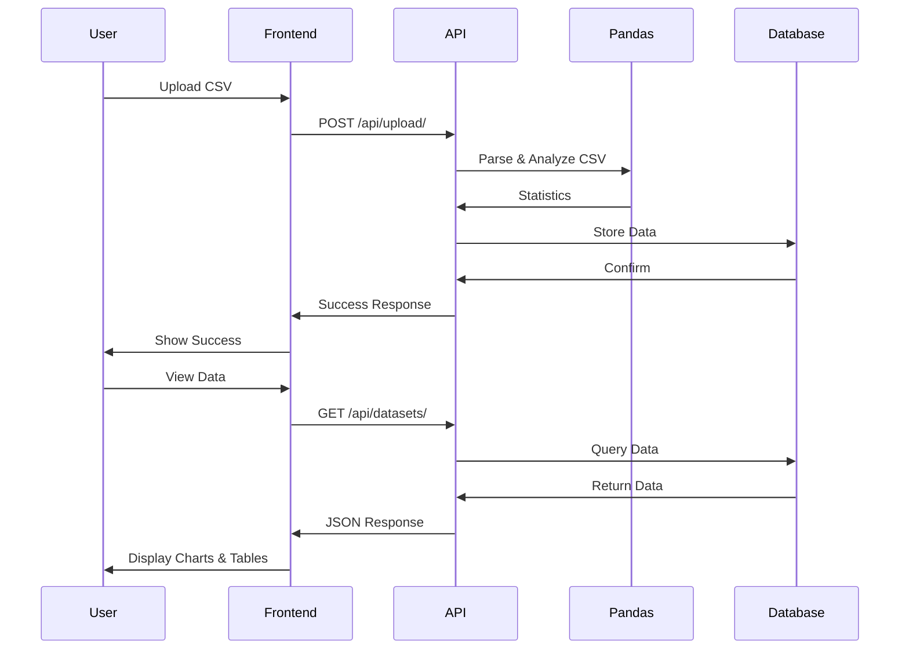
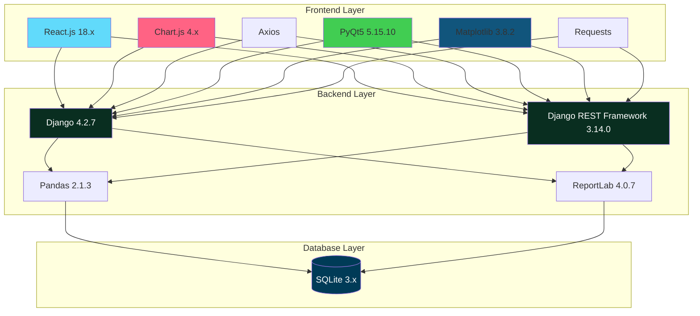
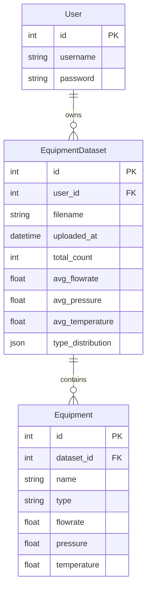

# System Architecture

## Architecture Diagram



## Component Structure



## Data Flow



## Technology Stack



## Database Schema



## Project Structure

```
chemical-visualizer/
├── backend/                    # Django REST API
│   ├── api/                   # Models, Views, Serializers
│   ├── config/                # Settings
│   └── venv/                  # Virtual Environment
│
├── frontend/                   # React Web App
│   └── src/components/        # Modular Components
│       ├── Login/             # Login.js + Login.css
│       ├── Header/            # Header.js + Header.css
│       ├── UploadSection/     # UploadSection.js + .css
│       ├── DatasetHistory/    # DatasetHistory.js + .css
│       ├── Charts/            # Charts.js + Charts.css
│       └── DatasetDetails/    # DatasetDetails.js + .css
│
├── desktop/                    # PyQt5 Desktop App
│   ├── app.py                 # Main Application
│   └── components/            # Modular Components
│       ├── Login/             # login_widget.py (with styling)
│       ├── Header/            # header_widget.py (with styling)
│       ├── Upload/            # upload_widget.py (with styling)
│       ├── History/           # history_widget.py (with styling)
│       ├── Data/              # data_widget.py (with styling)
│       └── Chart/             # chart_widget.py
│
└── sample_equipment_data.csv  # Test Data
```

## API Endpoints

| Method | Endpoint | Auth | Description |
|--------|----------|------|-------------|
| POST | `/api/register/` | No | Register new user |
| POST | `/api/login/` | No | Login user |
| POST | `/api/upload/` | Yes | Upload CSV file |
| GET | `/api/datasets/` | Yes | Get last 5 datasets |
| GET | `/api/datasets/<id>/` | Yes | Get dataset details |
| GET | `/api/datasets/<id>/pdf/` | Yes | Download PDF report |

## Key Features

- ✅ **Dual Interface**: Web (React) + Desktop (PyQt5)
- ✅ **Component-Based**: Modular architecture for easy maintenance
- ✅ **CSV Processing**: Pandas for data analysis
- ✅ **Visualizations**: Chart.js (Web) + Matplotlib (Desktop)
- ✅ **Authentication**: Basic HTTP Auth
- ✅ **History Management**: Last 5 datasets per user
- ✅ **PDF Reports**: ReportLab for report generation
- ✅ **Persistent Login**: Desktop app saves credentials